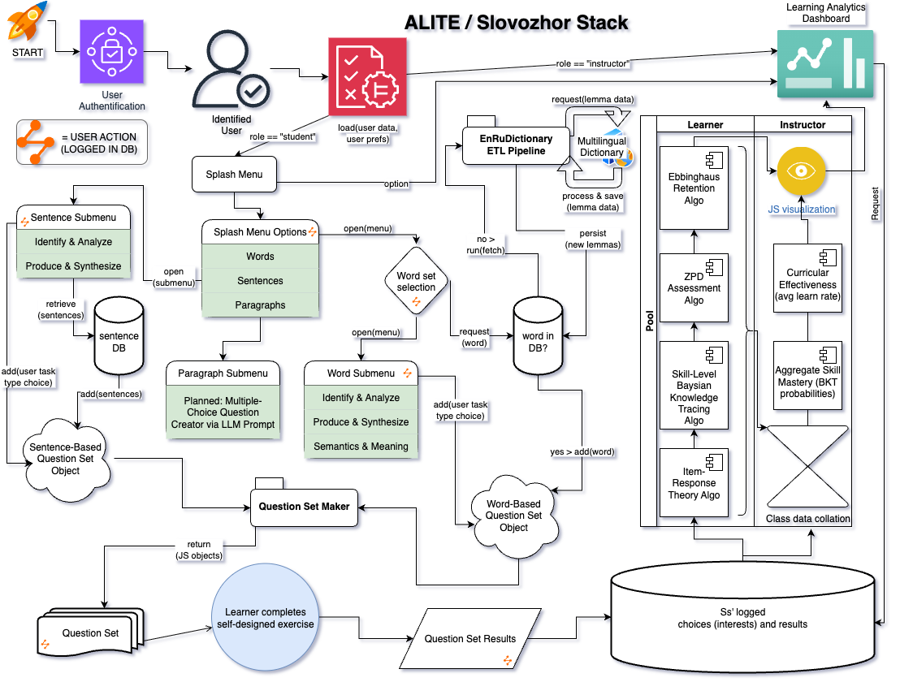

# Autonomous Learning and Informed Teaching Engine (ALITE)

## BLUF

ALITE is an educational data analytics platform that combines learning science principles and learner-centered design to give students and instructors alike informed decisions about their education-related questions.

*Slovozhor* (from the Russian for "vocab trainer" or "word eater") is the learner-facing portal where students create and work through their own study materials. Their selections and results are analyzed by ALITE before being delivered to the students' and instructors' respective dashboards.

## Stack

- Backend
  - Python (v3.12) - data handling and analysis
  - Selected dependencies
    - FastAPI (v0.115.12) - API web server framework
    - Pydantic (v2.11.4) - data validation
    - SQLAlchemy (v2.0.40) - database communication
    - Pandas (v2.2.3) - data organization and manipulation
    - Requests (v2.32.3) - HTTPS calls (to dictionary API)
    - Uvicorn (v0.34.2) - ASGI implementation
    - Poetry (v2.1.4) - environment manager
- Database
  - PostgreSQL (v14.18) - database management
  - [DB schema](./docs/db-schema.md)
- Frontend
  - Node.js (v23.11.0) - JS runtime
  - ReactJS (v19.1.0) - data transfer and presentation
  - Axios (v1.12.2) - API client
  - Vite (v7.1.6) - development optimization
  - TailwindCSS (v3.4.17) - inline CSS styling
  - Radix UI (v1.4.2) - modern ui
  - Zustand (v5.0.5) - state management
  - pnpm (v10.11.0) - environment manager
- Container
  - Docker (v4.46.0) - container manager

## Architecture Overview

## Run

### Development

>docker compose [] up
